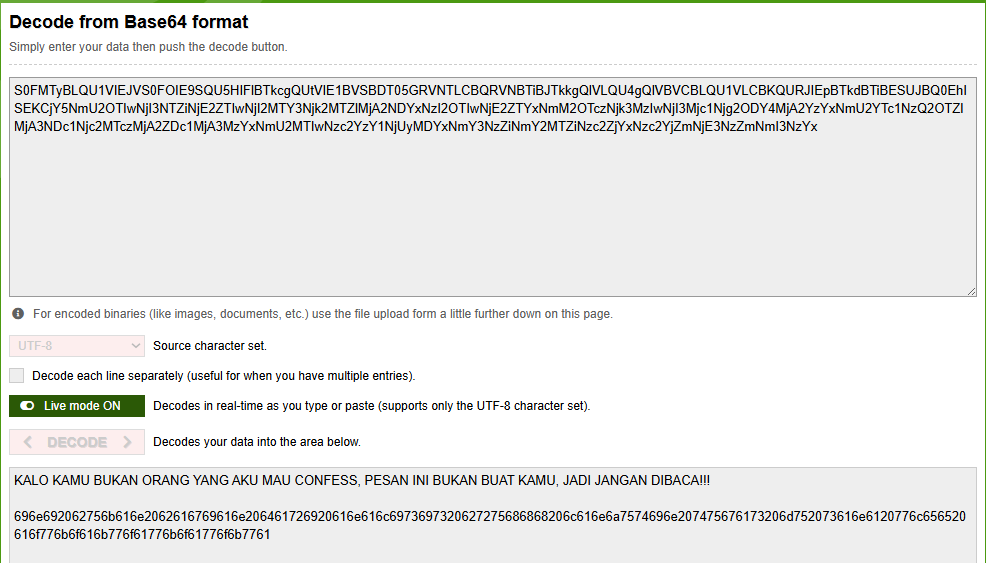

# KJK-PCAP-Traffic-Analysis

`Kuis_Kelompok_NRP1_NRP2.pdf`

| Nama | NRP |
| --- | --- |
| Jonat | 036 |
| Pedo | 120 |

---

## 1.

## 2. 

## 3. 

## 4. 

## 5. 

## Nomer 6 sampe 10

### **6. What does the malware encode the data in before transferring? (5 poin)**

* **Jawaban:** **Base64**

* **Display Filter:** `tcp.flags.push == 1`

* **Langkah-Langkah Pengerjaan:**
    1. Pilih paket TCP dari malware yang membawa *payload* data.
    2. Periksa kolom **Packet Bytes** atau buka jendela **Follow $\rightarrow$ TCP Stream** untuk melihat karakter *payload*.
    3. Amati string teks yang ditransmisikan, seperti `S3VuY2ktSmF3YWJhbi1RdWl6LUtKSy50eHQ=` atau `TmlsYWktUXVpei1LSksuY3N2`.
    4. String tersebut menggunakan set karakter alfanumerik (`A-Z`, `a-z`, `0-9`), simbol `+`/`/`, dan diakhiri *padding* `=`. Saat didekode menggunakan algoritma Base64, hasilnya terbaca sebagai teks biasa (*plaintext*).

* **Teori & Penjelasan Singkat:**
    > Malware sering kali mengodekan data biner atau teks menggunakan **Base64** (*binary-to-text encoding*) sebelum ditransmisikan. Hal ini bertujuan untuk menjaga integritas data agar tidak rusak oleh transmisi protokol jaringan serta melakukan *obfuscation* sederhana untuk mengelabui sistem pemantau jaringan dasar (IDS/IPS).

---

### **7. What is the name of the final file sent by the malware? (10 poin)**

* **Jawaban:** **`CONFESSION`**

* **Display Filter:** `frame.number == 32`

* **Langkah-Langkah Pengerjaan:**

    1. Amati urutan transmisi file pada jendela **Follow $\rightarrow$ TCP Stream** atau periksa paket-paket berkode `[PSH, ACK]` dari IP `10.0.2.15`.
    2. Malware mengirimkan nama file sebelum mengirimkan isi filenya. Urutan file yang dikirim adalah:
        * File 1: `Kunci-Jawaban-Quiz-KJK.txt` (Paket 4) `S3VuY2ktSmF3YWJhbi1RdWl6LUtKSy50eHQ`.
        * File 2: `Nilai-Quiz-KJK.csv` (Paket 11) `TmlsYWktUXVpei1LSksuY3N2`.
        * File 3: `IMPORTANT_NOTES` (Paket 18) `SU1QT1JUQU5UX05PVEVT`.
        * File 4: `Bank-Soal-Quiz-KJK.txt` (Paket 25) `QmFuay1Tb2FsLVF1aXotS0pLLnR4dA`.
        * File 5 (Terakhir): Paket ke-32 membawa *payload* `Q09ORkVTU0lPTg`.

    3. Dekode string Base64 `Q09ORkVTU0lPTg` menggunakan terminal atau decoder online:
    Terminal
    ```bash
    echo "Q09ORkVTU0lPTg" | base64 -d
    ```
    Online Decoder
    
    

* **Teori & Penjelasan Singkat:**
    > Sebelum koneksi diakhiri dengan sinyal `FIN`, Paket ke-22 merupakan pengiriman nama berkas terakhir dari malware ke *listener*. String mentah Base64 `Q09ORkVTU0lPTg==` terdekode sempurna menjadi nama file **`CONFESSION`**.

---

### **8. What are the contents of the 3rd file sent by the malware? (10 poin)**

* **Jawaban:**
    * **Nama Berkas Ke-3:** `IMPORTANT_NOTES`
    * **Isi Berkas (Plaintext):** Lorem Ipsum.

* **Display Filter:** `frame.number == 18`

* **Langkah-Langkah Pengerjaan:**

    1. Identifikasi pengiriman nama file ke-3 pada Paket 16 (`IMPORTANT_NOTES`).
    2. Buka Paket ke-18 yang merupakan *payload* data isi dari file ke-3 tersebut.
    3. Ambil string Base64 dari Paket ke-18 (`TG9yZW0gaXBzdW0gZG9sb3Igc2l0IGFtZXQsIGNv...`).
    4. Dekode string tersebut ke format *plaintext*:
    ```text
    Lorem ipsum dolor sit amet, consectetur adipiscing elit. Nulla diam risus, fermentum nec tempor a, lobortis non erat. Praesent vel eros nec elit facilisis dapibus tempor a ex. Morbi a nulla in ex ullamcorper bibendum. Mauris sit amet tincidunt enim, nec commodo magna. Praesent rutrum, libero in faucibus suscipit, odio lorem posuere eros, maximus rhoncus metus ligula eget nibh. In hac habitasse platea dictumst. Vestibulum pellentesque, quam sed sagittis iaculis, magna lorem interdum massa, in tempus tellus lectus vitae mauris. Nulla dolor ligula, volutpat efficitur magna sit amet, consectetur dapibus mi. Maecenas eget tempor lacus. Quisque molestie velit tempor nulla pretium, non gravida neque volutpat. Vivamus pulvinar efficitur dui vehicula faucibus.

    Donec dignissim ante massa, porttitor tempus orci iaculis id. Ut lectus metus, eleifend commodo blandit ac, tempus vel tortor. Mauris blandit et tellus sed iaculis. Vestibulum ut lacinia est. Nullam et metus lectus. Nam congue porttitor dui. Pellentesque ultricies aliquam erat vel pharetra. Donec et libero tortor. Integer sed urna et leo tempus suscipit eget nec augue. Mauris vel imperdiet est. Mauris in aliquet diam. Suspendisse sapien velit, tincidunt at varius vel, finibus quis lacus. In pretium vehicula nunc, porttitor tincidunt sapien molestie nec. Morbi vehicula vestibulum luctus.

    Sed porta vestibulum ipsum id pharetra. Morbi dignissim leo a neque mattis, eget fermentum turpis pretium. Donec sed neque lectus. Phasellus in enim ultricies, ultrices eros eget, lobortis turpis. Praesent auctor eros vitae magna tincidunt pharetra. Pellentesque pretium eros vel quam elementum iaculis. Quisque nec est tincidunt, elementum sapien sed, condimentum enim. Mauris vestibulum imperdiet leo, sed efficitur eros commodo in. 
    ```

* **Teori & Penjelasan Singkat:**
    > Isi dari berkas ke-3 (`IMPORTANT_NOTES`) dikirimkan pada Paket 18 dalam bentuk terenkode Base64. Setelah didekode, muatan berkas memuat file txt berisi Lorem Ipsum.

---

### **9. What are the status signal sent by the malware to the listener if it has NOT finished sending files? And whats the status signal if it is finished? (15 poin)**

* **Jawaban:**
    * **Sinyal Belum Selesai (NOT Finished):** `Pj4+` $\rightarrow$ **`>>>`**
    * **Sinyal Selesai (Finished):** `RklO` $\rightarrow$ **`FIN`**

* **Display Filter:** `frame.number == 8 || frame.number == 15 || frame.number == 22 || frame.number == 29`

* **Langkah-Langkah Pengerjaan:**
    1. Periksa interaksi kontrol di antara pengiriman setiap file.
    2. Setelah mengirimkan File 1, File 2, File 3, dan File 4 (pada Paket 8, 15, 22, 29), malware mengirimkan *payload* Base64 `Pj4+`. Hasil dekode `Pj4+` adalah **`>>>`**, menandakan transisi/belum selesai.
    3. Setelah seluruh file selesai dikirimkan (setelah File 5 pada Paket 36), malware mengirimkan *payload* Base64 `RklO`. Hasil dekode `RklO` adalah **`FIN`**, menandakan transmisi selesai.

* **Teori & Penjelasan Singkat:**
    > Malware menerapkan protokol aplikasi kustom sederhananya sendiri. String `>>>` berfungsi sebagai sinyal *delimiting/continuation* (transisi antarbeberapa file), sedangkan string `FIN` digunakan sebagai *acknowledgement* akhir bahwa seluruh rangkaian *exfiltration* file telah selesai dilakukan.

---

### **10. What is the killswitch sent by the listener to the malware if the finished status signal has been sent by the malware? (10 poin)**

* **Jawaban:** **`jangandalupatryhardctfcompit2025`**

* **Display Filter:** `frame.number == 38`

* **Langkah-Langkah Pengerjaan:**
    1. Cari paket balasan dari arah `172.31.66.144` ke `172.31.64.1` yang dikirimkan **setelah** malware mengirim sinyal `FIN` di Paket 36.
    2. Buka **Paket ke-38** pada Wireshark.
    3. Periksa panel **Packet Bytes** (ASCII) pada Paket 38.
    4. Temukan string *Base64* dengan balasan `amFuZ2FubHVwYXRyeWhhcmRjdGZjb21waXQyMDI1` yang jika didecode akan menjadi `jangandalupatryhardctfcompit2025`.

* **Teori & Penjelasan Singkat:**
    > Tepat setelah malware mengirimkan sinyal `FIN` pada Paket 24, *listener* merespons pada Paket 38 dengan mengirimkan string *Base64* `jangandalupatryhardctfcompit2025`. String ini bertindak sebagai *killswitch* atau perintah pemutus interaksi dari server Command & Control (C2) kepada malware.